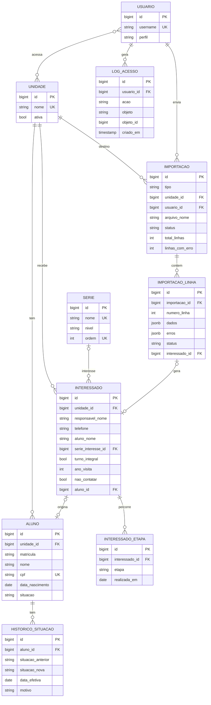

# Diagrama ER: Sistema Pedagógico

```mermaid
erDiagram
  UNIDADE ||--o{ INTERESSADO : recebe
  UNIDADE ||--o{ ALUNO : tem
  UNIDADE ||--o{ IMPORTACAO : destino
  SERIE |o--o{ INTERESSADO : interesse
  INTERESSADO ||--o{ INTERESSADO_ETAPA : percorre
  INTERESSADO |o--o| ALUNO : origina
  ALUNO ||--o{ HISTORICO_SITUACAO : tem
  IMPORTACAO ||--o{ IMPORTACAO_LINHA : contem
  IMPORTACAO_LINHA |o--o| INTERESSADO : gera
  USUARIO ||--o{ IMPORTACAO : envia
  USUARIO ||--o{ LOG_ACESSO : gera
  USUARIO }o--o{ UNIDADE : acessa

  UNIDADE {
    bigint id PK
    string nome UK
    bool ativa
  }
  SERIE {
    bigint id PK
    string nome UK
    string nivel
    int ordem UK
  }
  INTERESSADO {
    bigint id PK
    bigint unidade_id FK
    string responsavel_nome
    string telefone
    string aluno_nome
    bigint serie_interesse_id FK
    bool turno_integral
    int ano_visita
    bool nao_contatar
    bigint aluno_id FK
  }
  INTERESSADO_ETAPA {
    bigint id PK
    bigint interessado_id FK
    string etapa
    date realizada_em
  }
  ALUNO {
    bigint id PK
    bigint unidade_id FK
    string matricula
    string nome
    string cpf UK
    date data_nascimento
    string situacao
  }
  HISTORICO_SITUACAO {
    bigint id PK
    bigint aluno_id FK
    string situacao_anterior
    string situacao_nova
    date data_efetiva
    string motivo
  }
  IMPORTACAO {
    bigint id PK
    string tipo
    bigint unidade_id FK
    bigint usuario_id FK
    string arquivo_nome
    string status
    int total_linhas
    int linhas_com_erro
  }
  IMPORTACAO_LINHA {
    bigint id PK
    bigint importacao_id FK
    int numero_linha
    jsonb dados
    jsonb erros
    string status
    bigint interessado_id FK
  }
  USUARIO {
    bigint id PK
    string username UK
    string perfil
  }
  LOG_ACESSO {
    bigint id PK
    bigint usuario_id FK
    string acao
    string objeto
    bigint objeto_id
    timestamp criado_em
  }
```
